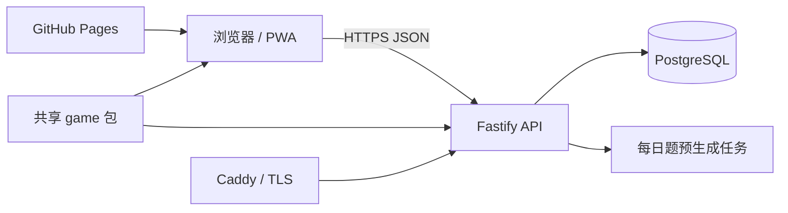
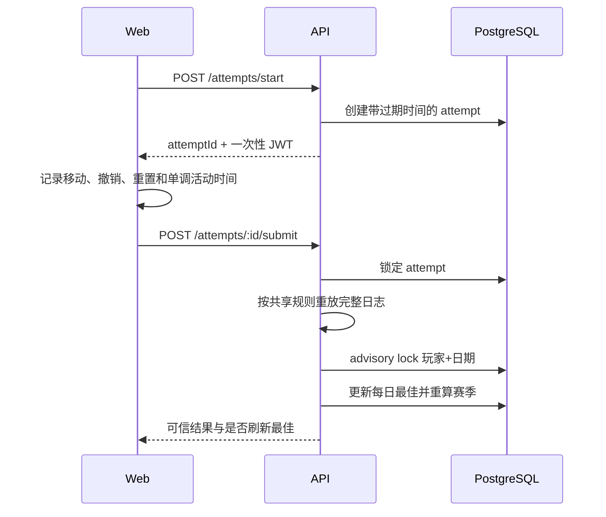

# 系统架构

## 总览

项目采用 npm workspaces：

- `@pathweave/game` 是唯一规则真相，前端用于即时反馈，后端用于可信重放。
- `@pathweave/api` 管理身份、正式题、尝试、排行榜和赛季聚合。
- `@pathweave/web` 负责 PWA、棋盘输入、练习关和成绩展示。

## 每日题生成

`generateDailyPuzzle(date)` 使用日期与 `GENERATOR_VERSION` 生成确定性种子：

1. 按星期确定难度；
2. 构造网格、障碍和必经格候选；
3. DFS 求解器检查至少两条合法路径与唯一最短解；
4. 在不破坏题目约束的前提下放置特殊格；
5. 从解集选择只有部分路径满足的印章或顺序挑战；
6. 生成失败时使用内置已验证备用题。

服务端每小时确保今天和明天的谜题存在。已经发布的谜题不可修改；未发布且生成器版本落后的题目可以被新版本替换。

## 正式尝试数据流

## 计时模型

- 客户端使用 `performance.now()` 记录单调活动时间，降低全球网络 RTT 对排名的影响。
- 服务端保存开始与提交墙钟时间，用于尝试过期和活动时长上限检查。
- 操作日志时间必须单调递增，不能晚于服务端墙钟时间。
- 最低合理时间同时考虑固定下限和路径移动数量。

这是一种实用级公平方案，不是强对抗赛事计时系统。

## 排行榜一致性

同一玩家、同一日期的成绩更新执行以下事务：

1. 获取 `pg_advisory_xact_lock`；
2. 锁定现有 `daily_best_scores`；
3. 判断新成绩是否更优；
4. 原子 UPSERT 每日最佳；
5. 从当月每日最佳重新聚合 `season_scores`。

重新聚合避免增量更新在重试、并发或异常恢复后产生漂移。

## 身份与恢复

- 首次访问自动创建匿名玩家。
- 访问令牌是带 `credential_version` 的长期 JWT。
- 恢复码使用随机字节生成，服务端只保存 SHA-256 摘要。
- 恢复成功后立即撤销旧恢复码、增加凭据版本并签发新凭据。

## 离线边界

PWA 缓存应用外壳与练习关。正式题、身份、成绩和排行榜必须联网。为保证计时可信，正式成绩不会离线排队后延迟提交。
